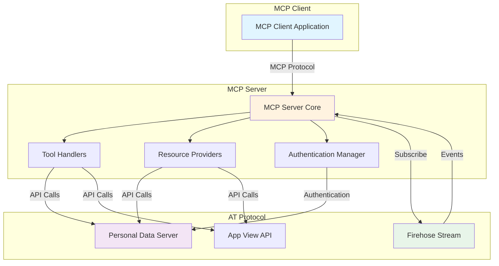
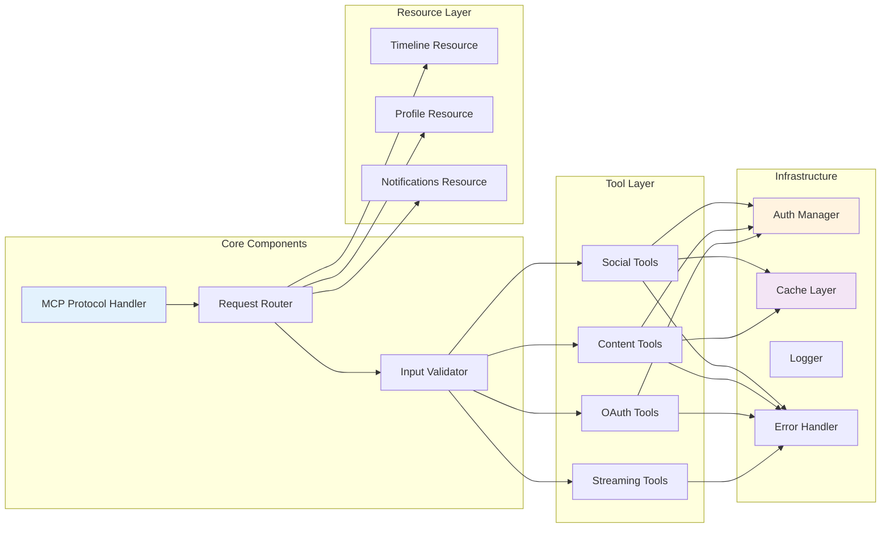
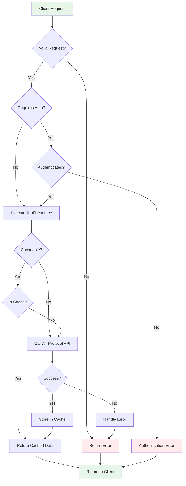
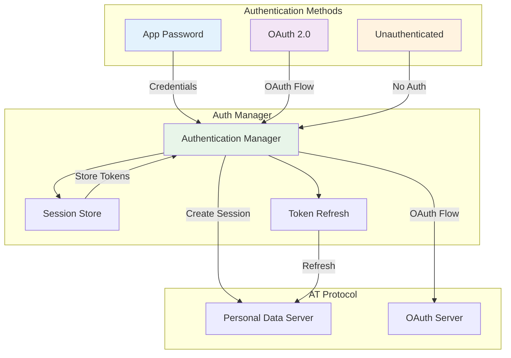
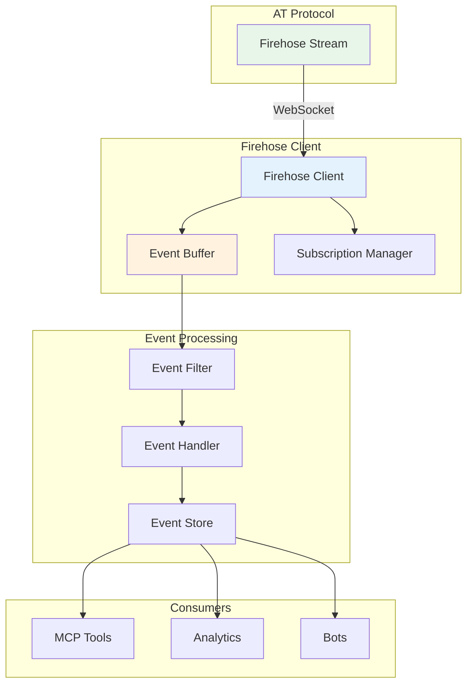
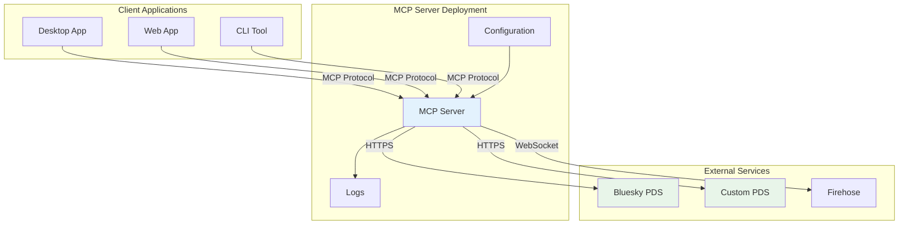
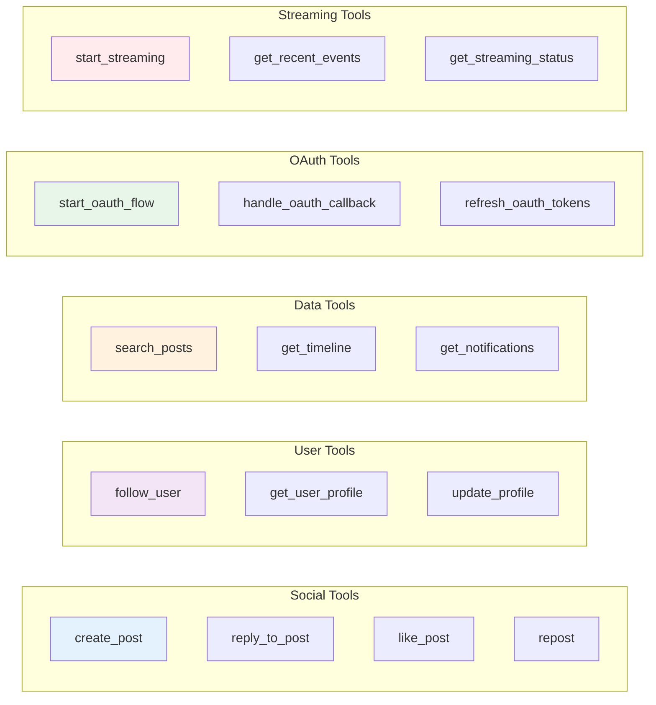
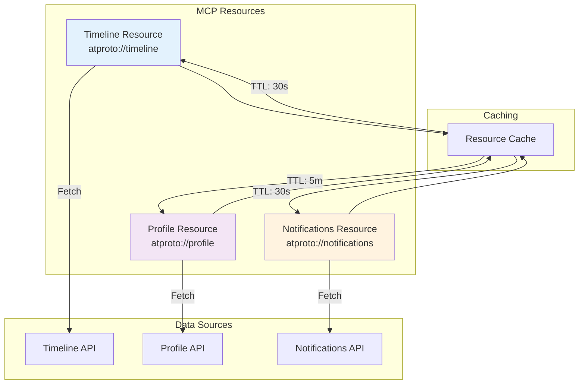
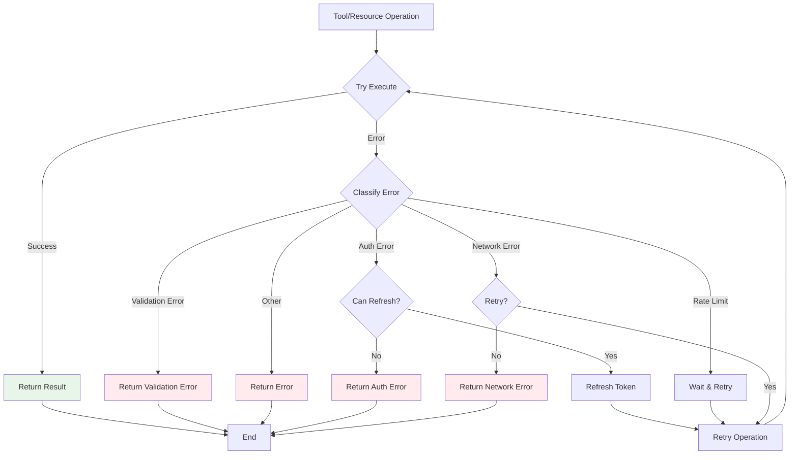

# Architecture Diagrams

Visual representations of the AT Protocol MCP Server architecture.

## System Architecture

## Component Architecture

## Data Flow Architecture

## Authentication Architecture

## Streaming Architecture

## Deployment Architecture

## Tool Organization

## Resource Architecture

## Error Handling Architecture

## See Also

- [Flow Charts](./flows.md)
- [Sequence Diagrams](./sequences.md)
- [API Reference](../api/)

