# Architecture & Diagrams

Visual representations of the AT Protocol MCP Server architecture and the
interaction sequences behind common operations.

::: tip Transport

The server communicates with MCP clients over **stdio only**
(`StdioServerTransport`). It does not bind a network port or expose an HTTP
endpoint. Outbound calls to the AT Protocol use HTTPS.

:::

## System Architecture

The server sits between an MCP client and the AT Protocol. Tools and resources
call the AT Protocol over HTTPS (the PDS for record writes, the App View for
read/aggregation queries).

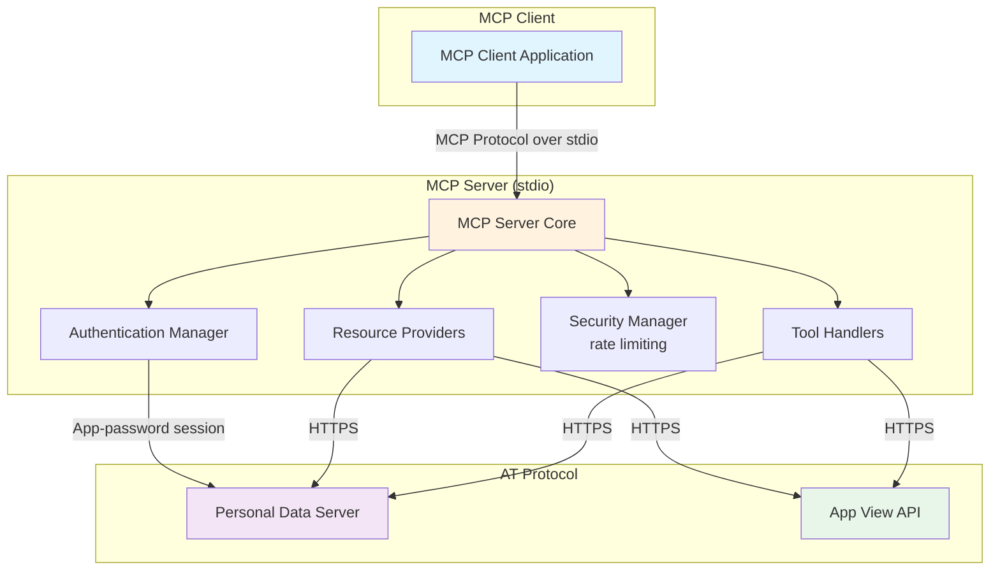
```mermaid
graph TB
    subgraph "MCP Client"
        Client[MCP Client Application]
    end

    subgraph "MCP Server (stdio)"
        Server[MCP Server Core]
        Tools[Tool Handlers]
        Resources[Resource Providers]
        Security[Security Manager<br/>rate limiting]
        Auth[Authentication Manager]
    end

    subgraph "AT Protocol"
        PDS[Personal Data Server]
        AppView[App View API]
    end

    Client -->|MCP Protocol over stdio| Server
    Server --> Security
    Server --> Tools
    Server --> Resources
    Server --> Auth

    Tools -->|HTTPS| PDS
    Tools -->|HTTPS| AppView
    Resources -->|HTTPS| PDS
    Resources -->|HTTPS| AppView
    Auth -->|App-password session| PDS

    style Client fill:#e1f5ff
    style Server fill:#fff3e0
    style PDS fill:#f3e5f5
    style AppView fill:#e8f5e9
```

::: warning Streaming is not wired into this diagram

Firehose/streaming tools are registered but **not functional** — firehose
decoding is gated off, so the server opens no WebSocket and surfaces no live
events. See [Experimental & Roadmap](../guide/experimental.md).

:::

## Request Data Flow

Every tool invocation is rate limited per tool (100 requests per minute per
tool) before it runs. Most tools require an authenticated session; a few
public/enhanced tools (such as `get_user_profile`, `get_user_connections`, and
`get_author_feed`) run unauthenticated. `search_posts` is **not** one of them —
it requires authentication, since the AT Protocol search API changed in 2025 to
require auth.

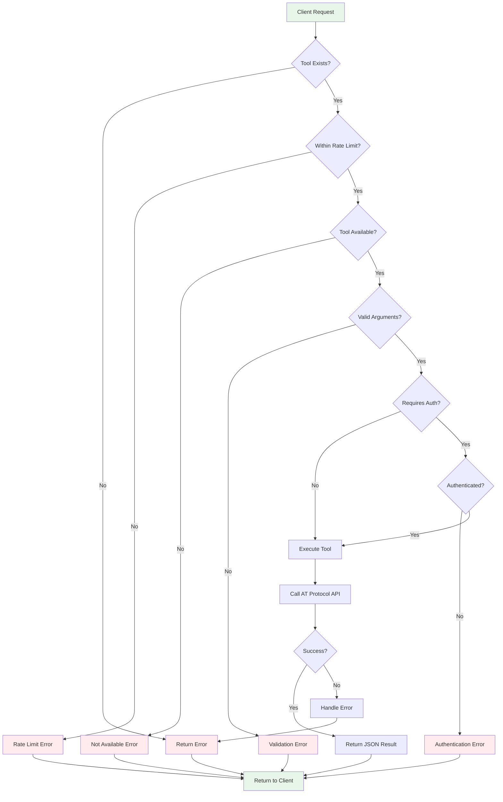
```mermaid
flowchart TD
    Start[Client Request] --> Lookup{Tool Exists?}
    Lookup -->|No| Error[Return Error]
    Lookup -->|Yes| RateLimit{Within Rate Limit?}

    RateLimit -->|No| RateError[Rate Limit Error]
    RateLimit -->|Yes| Available{Tool Available?}

    Available -->|No| UnavailError[Not Available Error]
    Available -->|Yes| Validate{Valid Arguments?}

    Validate -->|No| ValidationError[Validation Error]
    Validate -->|Yes| Auth{Requires Auth?}

    Auth -->|No| Execute[Execute Tool]
    Auth -->|Yes| CheckAuth{Authenticated?}

    CheckAuth -->|No| AuthError[Authentication Error]
    CheckAuth -->|Yes| Execute

    Execute --> API[Call AT Protocol API]
    API --> Success{Success?}
    Success -->|Yes| Return[Return JSON Result]
    Success -->|No| HandleError[Handle Error]

    HandleError --> Error
    Return --> End[Return to Client]
    Error --> End
    RateError --> End
    UnavailError --> End
    ValidationError --> End
    AuthError --> End

    style Start fill:#e8f5e9
    style End fill:#e8f5e9
    style Error fill:#ffebee
    style RateError fill:#ffebee
    style UnavailError fill:#ffebee
    style ValidationError fill:#ffebee
    style AuthError fill:#ffebee
```

::: tip Results are JSON text

Tool results are returned as stringified JSON text content, not a guaranteed
structured schema.

:::

## Tool Organization

A representative slice of the 60 tools, grouped by area. (Streaming and OAuth
completion tools exist but are experimental/non-functional — see
[Experimental & Roadmap](../guide/experimental.md).)

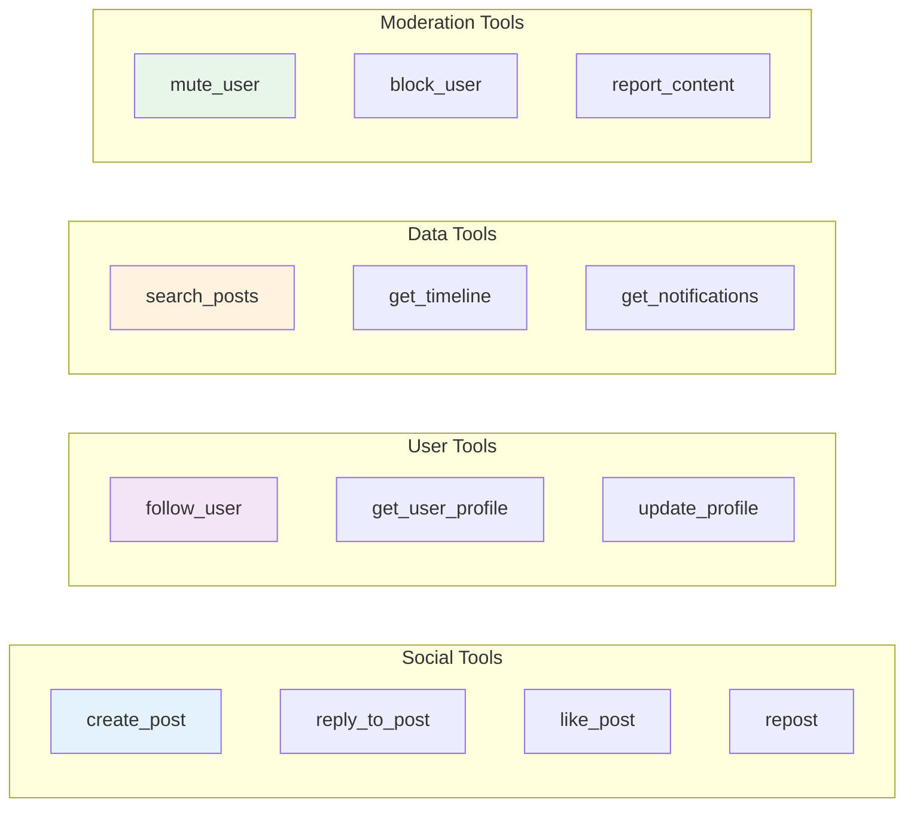
```mermaid
graph LR
    subgraph "Social Tools"
        Post[create_post]
        Reply[reply_to_post]
        Like[like_post]
        Repost[repost]
    end

    subgraph "User Tools"
        Follow[follow_user]
        Profile[get_user_profile]
        Update[update_profile]
    end

    subgraph "Data Tools"
        Search[search_posts]
        Timeline[get_timeline]
        Notifications[get_notifications]
    end

    subgraph "Moderation Tools"
        Mute[mute_user]
        Block[block_user]
        Report[report_content]
    end

    style Post fill:#e3f2fd
    style Follow fill:#f3e5f5
    style Search fill:#fff3e0
    style Mute fill:#e8f5e9
```

## Resources

The server registers **4 resources**. Three are functional and fetch live data
from the AT Protocol (they require authentication). The fourth is a registered
placeholder.

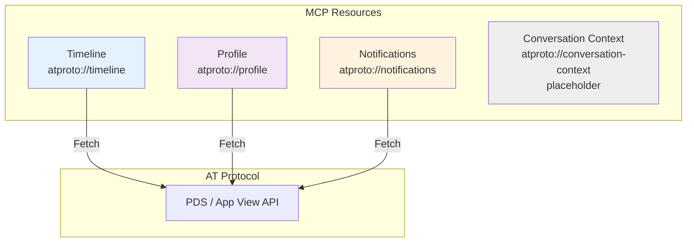
```mermaid
graph TB
    subgraph "MCP Resources"
        Timeline[Timeline<br/>atproto://timeline]
        Profile[Profile<br/>atproto://profile]
        Notifs[Notifications<br/>atproto://notifications]
        Convo[Conversation Context<br/>atproto://conversation-context<br/>placeholder]
    end

    subgraph "AT Protocol"
        API[PDS / App View API]
    end

    Timeline -->|Fetch| API
    Profile -->|Fetch| API
    Notifs -->|Fetch| API

    style Timeline fill:#e3f2fd
    style Profile fill:#f3e5f5
    style Notifs fill:#fff3e0
    style Convo fill:#eeeeee
```

::: warning Placeholder resource

`atproto://conversation-context` is registered and readable, but the server
never auto-populates it — reads return empty/near-empty content. See
[Experimental & Roadmap](../guide/experimental.md).

:::

## Post Creation Flow

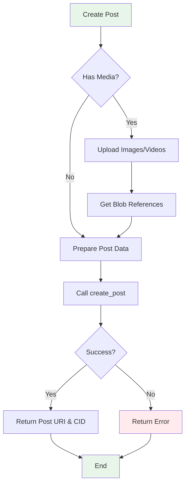
```mermaid
flowchart TD
    Start[Create Post] --> HasMedia{Has Media?}

    HasMedia -->|Yes| UploadMedia[Upload Images/Videos]
    HasMedia -->|No| PreparePost[Prepare Post Data]

    UploadMedia --> GetBlobs[Get Blob References]
    GetBlobs --> PreparePost

    PreparePost --> CreatePost[Call create_post]
    CreatePost --> Success{Success?}

    Success -->|Yes| ReturnURI[Return Post URI & CID]
    Success -->|No| Error[Return Error]

    ReturnURI --> End[End]
    Error --> End

    style Start fill:#e8f5e9
    style End fill:#e8f5e9
    style Error fill:#ffebee
```

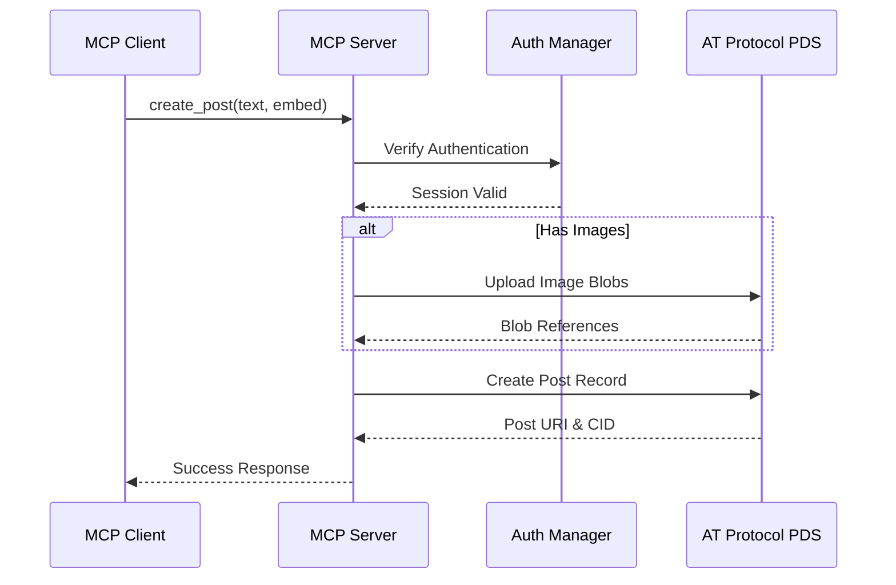
```mermaid
sequenceDiagram
    participant Client as MCP Client
    participant Server as MCP Server
    participant Auth as Auth Manager
    participant PDS as AT Protocol PDS

    Client->>Server: create_post(text, embed)
    Server->>Auth: Verify Authentication
    Auth-->>Server: Session Valid

    alt Has Images
        Server->>PDS: Upload Image Blobs
        PDS-->>Server: Blob References
    end

    Server->>PDS: Create Post Record
    PDS-->>Server: Post URI & CID
    Server-->>Client: Success Response
```

## Search and Pagination

`search_posts` returns a page of results plus an optional cursor; passing the
cursor back fetches the next page until no cursor is returned.

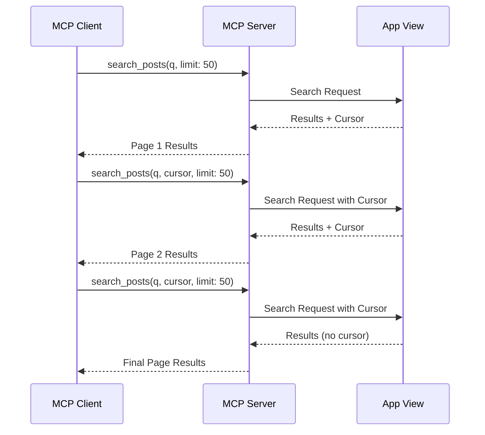
```mermaid
sequenceDiagram
    participant Client as MCP Client
    participant Server as MCP Server
    participant API as App View

    Client->>Server: search_posts(q, limit: 50)
    Server->>API: Search Request
    API-->>Server: Results + Cursor
    Server-->>Client: Page 1 Results

    Client->>Server: search_posts(q, cursor, limit: 50)
    Server->>API: Search Request with Cursor
    API-->>Server: Results + Cursor
    Server-->>Client: Page 2 Results

    Client->>Server: search_posts(q, cursor, limit: 50)
    Server->>API: Search Request with Cursor
    API-->>Server: Results (no cursor)
    Server-->>Client: Final Page Results
```

## Image Upload and Embed

Upload returns a blob reference; pass it into `create_post` to embed the image.

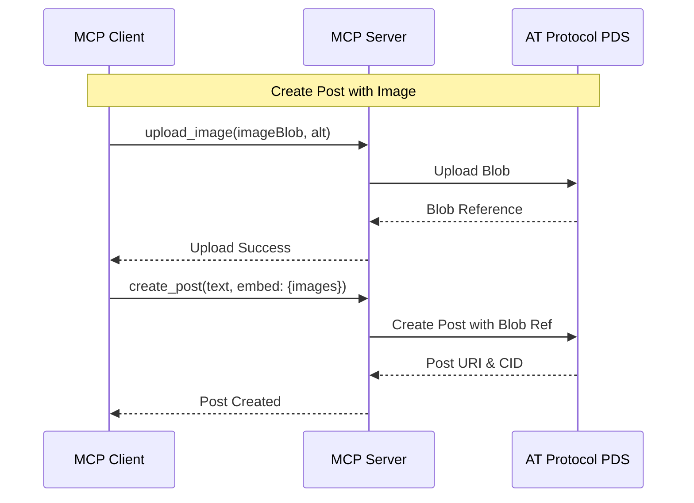
```mermaid
sequenceDiagram
    participant Client as MCP Client
    participant Server as MCP Server
    participant PDS as AT Protocol PDS

    Note over Client,PDS: Create Post with Image

    Client->>Server: upload_image(imageBlob, alt)
    Server->>PDS: Upload Blob
    PDS-->>Server: Blob Reference
    Server-->>Client: Upload Success

    Client->>Server: create_post(text, embed: {images})
    Server->>PDS: Create Post with Blob Ref
    PDS-->>Server: Post URI & CID
    Server-->>Client: Post Created
```

## Follow / Unfollow

`follow_user` returns the follow record's URI; pass it to `unfollow_user` to
remove the follow.

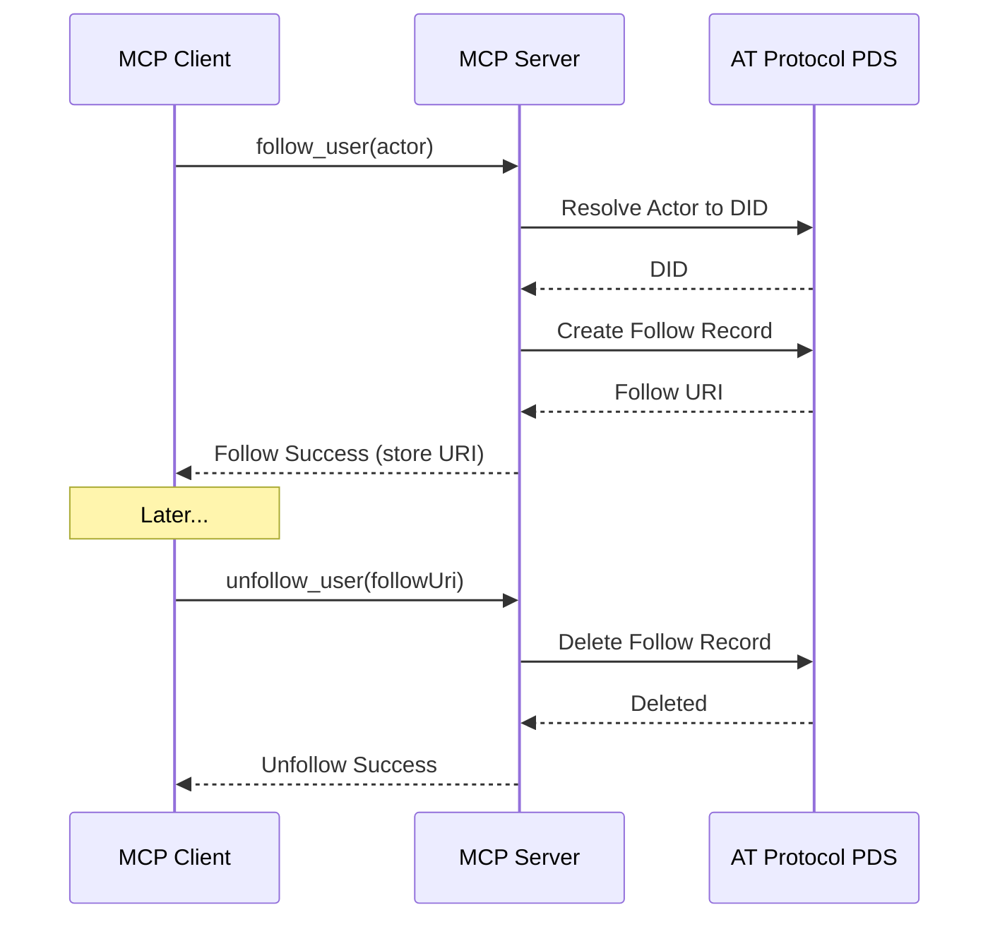
```mermaid
sequenceDiagram
    participant Client as MCP Client
    participant Server as MCP Server
    participant PDS as AT Protocol PDS

    Client->>Server: follow_user(actor)
    Server->>PDS: Resolve Actor to DID
    PDS-->>Server: DID

    Server->>PDS: Create Follow Record
    PDS-->>Server: Follow URI
    Server-->>Client: Follow Success (store URI)

    Note over Client: Later...

    Client->>Server: unfollow_user(followUri)
    Server->>PDS: Delete Follow Record
    PDS-->>Server: Deleted
    Server-->>Client: Unfollow Success
```

## Profile Update

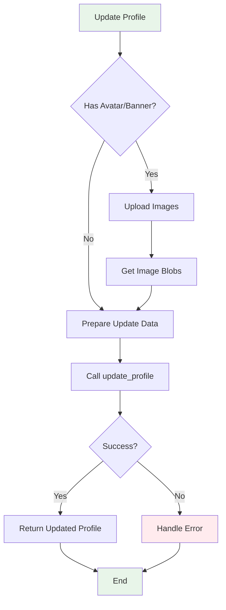
```mermaid
flowchart TD
    Start[Update Profile] --> HasImages{Has Avatar/Banner?}

    HasImages -->|Yes| UploadImages[Upload Images]
    HasImages -->|No| PrepareUpdate[Prepare Update Data]

    UploadImages --> GetImageBlobs[Get Image Blobs]
    GetImageBlobs --> PrepareUpdate

    PrepareUpdate --> CallUpdate[Call update_profile]
    CallUpdate --> Success{Success?}

    Success -->|Yes| Return[Return Updated Profile]
    Success -->|No| Error[Handle Error]

    Return --> End[End]
    Error --> End

    style Start fill:#e8f5e9
    style End fill:#e8f5e9
    style Error fill:#ffebee
```

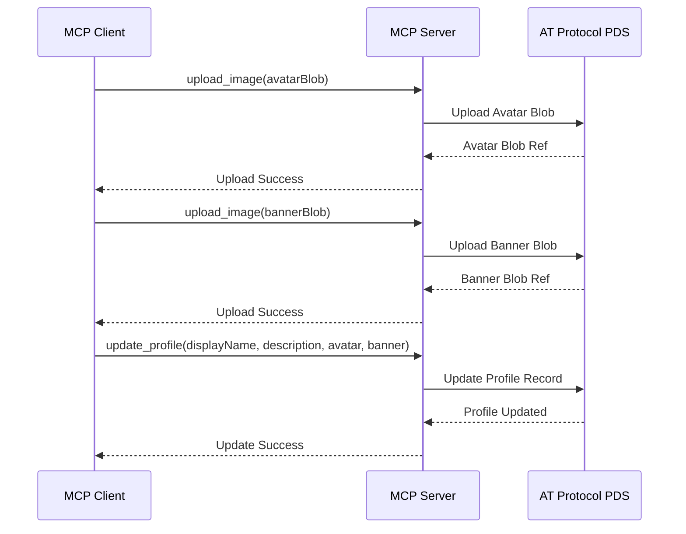
```mermaid
sequenceDiagram
    participant Client as MCP Client
    participant Server as MCP Server
    participant PDS as AT Protocol PDS

    Client->>Server: upload_image(avatarBlob)
    Server->>PDS: Upload Avatar Blob
    PDS-->>Server: Avatar Blob Ref
    Server-->>Client: Upload Success

    Client->>Server: upload_image(bannerBlob)
    Server->>PDS: Upload Banner Blob
    PDS-->>Server: Banner Blob Ref
    Server-->>Client: Upload Success

    Client->>Server: update_profile(displayName, description, avatar, banner)
    Server->>PDS: Update Profile Record
    PDS-->>Server: Profile Updated
    Server-->>Client: Update Success
```

## Moderation

Reports are submitted via `com.atproto.moderation.createReport`. Blocking and
muting write the corresponding records.

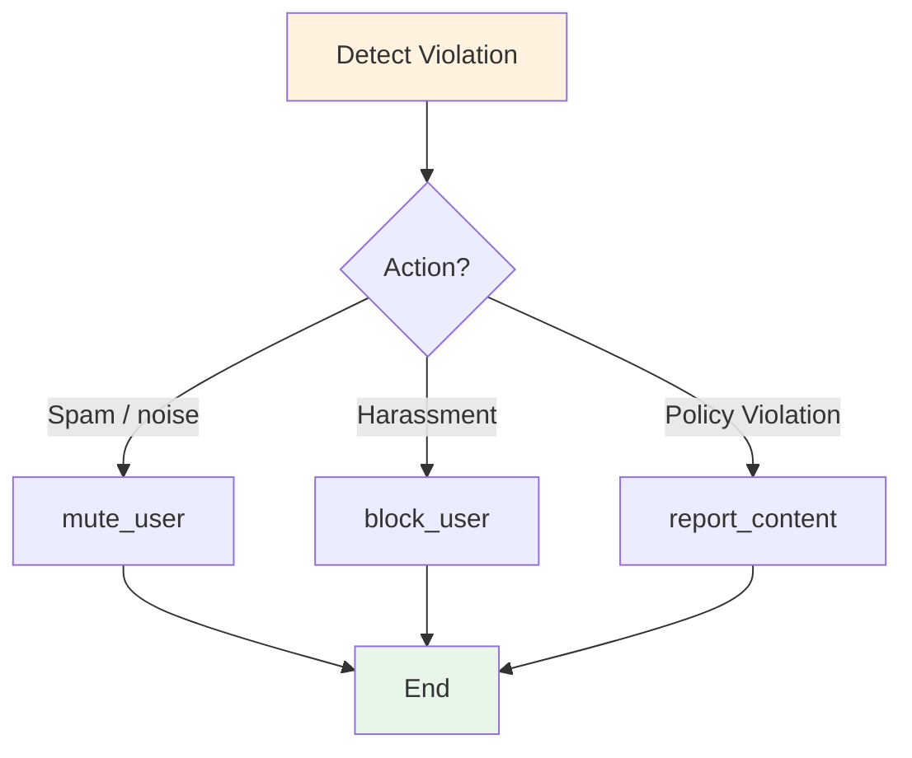
```mermaid
flowchart TD
    Start[Detect Violation] --> Classify{Action?}

    Classify -->|Spam / noise| MuteUser[mute_user]
    Classify -->|Harassment| BlockUser[block_user]
    Classify -->|Policy Violation| ReportContent[report_content]

    MuteUser --> End[End]
    BlockUser --> End
    ReportContent --> End

    style Start fill:#fff3e0
    style End fill:#e8f5e9
```

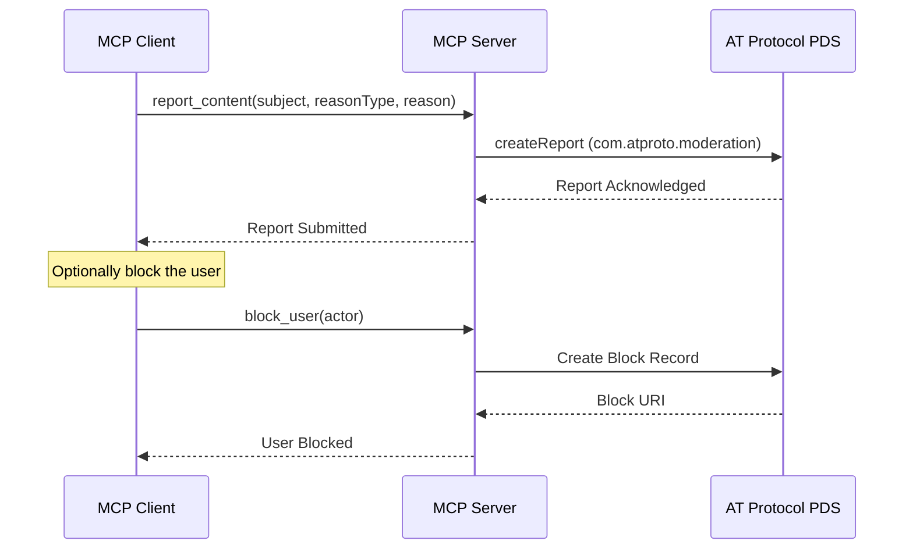
```mermaid
sequenceDiagram
    participant Client as MCP Client
    participant Server as MCP Server
    participant PDS as AT Protocol PDS

    Client->>Server: report_content(subject, reasonType, reason)
    Server->>PDS: createReport (com.atproto.moderation)
    PDS-->>Server: Report Acknowledged
    Server-->>Client: Report Submitted

    Note over Client: Optionally block the user

    Client->>Server: block_user(actor)
    Server->>PDS: Create Block Record
    PDS-->>Server: Block URI
    Server-->>Client: User Blocked
```

## Resource Access

Resources fetch directly from the AT Protocol on each read; there is no caching
layer.

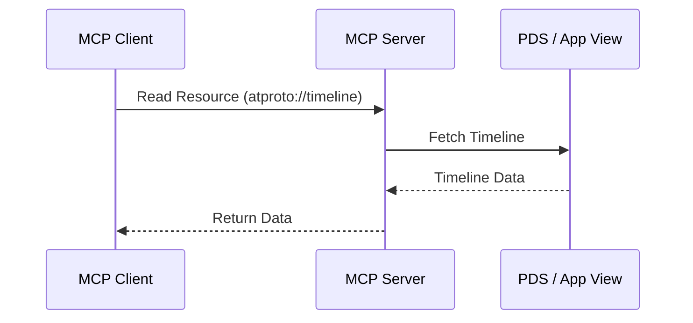
```mermaid
sequenceDiagram
    participant Client as MCP Client
    participant Server as MCP Server
    participant API as PDS / App View

    Client->>Server: Read Resource (atproto://timeline)
    Server->>API: Fetch Timeline
    API-->>Server: Timeline Data
    Server-->>Client: Return Data
```

## Error Handling

A rate-limited request from the AT Protocol surfaces to the client as a
rate-limit error; the client decides whether and when to retry.

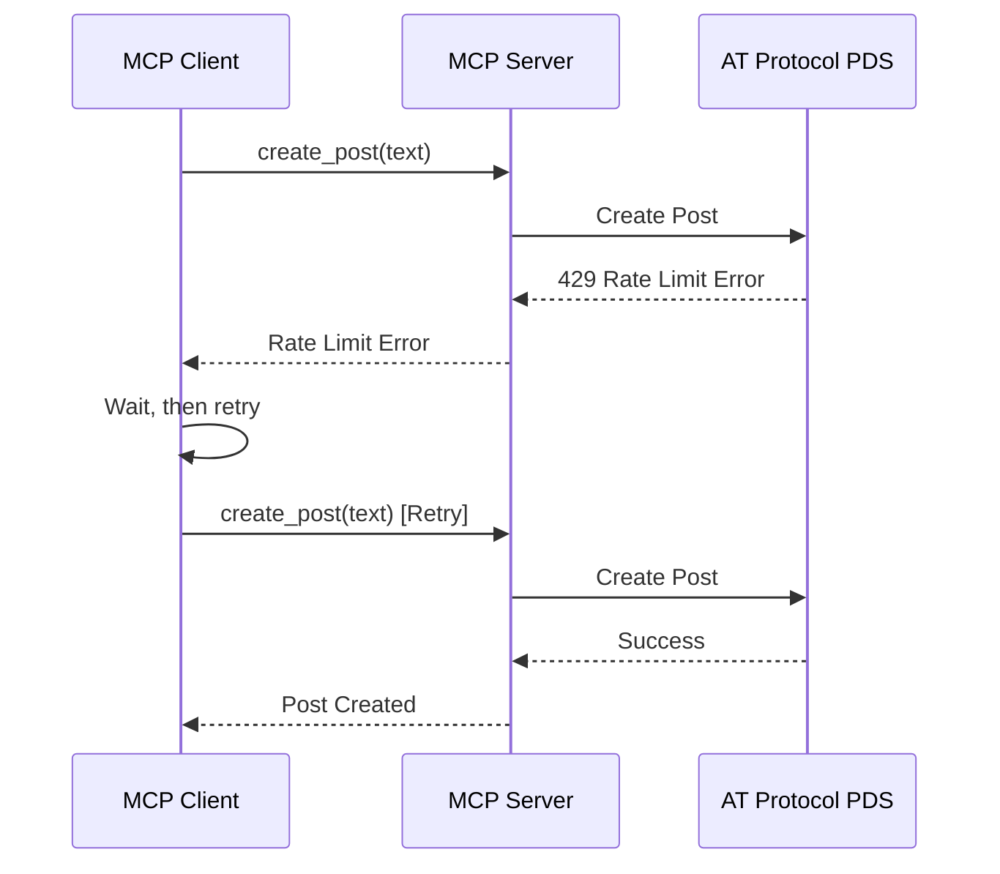
```mermaid
sequenceDiagram
    participant Client as MCP Client
    participant Server as MCP Server
    participant PDS as AT Protocol PDS

    Client->>Server: create_post(text)
    Server->>PDS: Create Post
    PDS-->>Server: 429 Rate Limit Error
    Server-->>Client: Rate Limit Error

    Client->>Client: Wait, then retry
    Client->>Server: create_post(text) [Retry]
    Server->>PDS: Create Post
    PDS-->>Server: Success
    Server-->>Client: Post Created
```

## See Also

- [Experimental & Roadmap](../guide/experimental.md)
- [API Reference](../api/)
