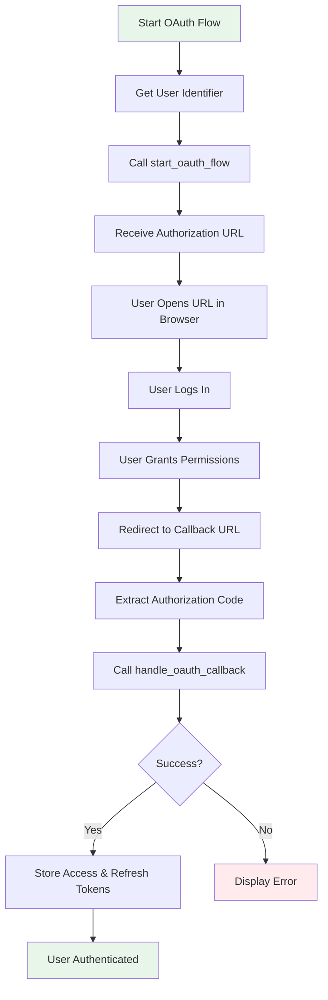
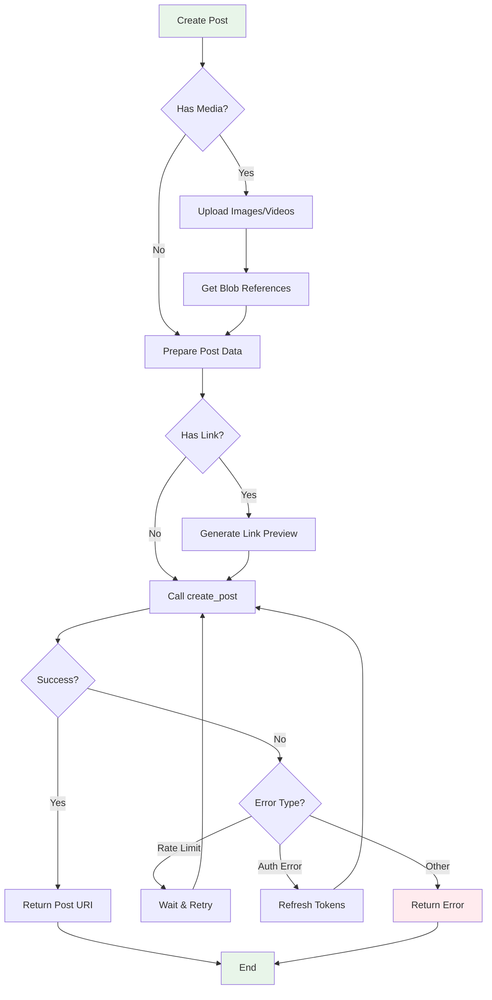
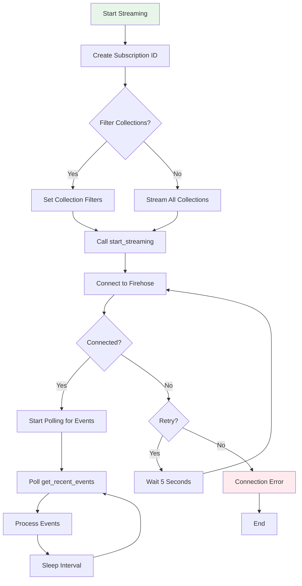
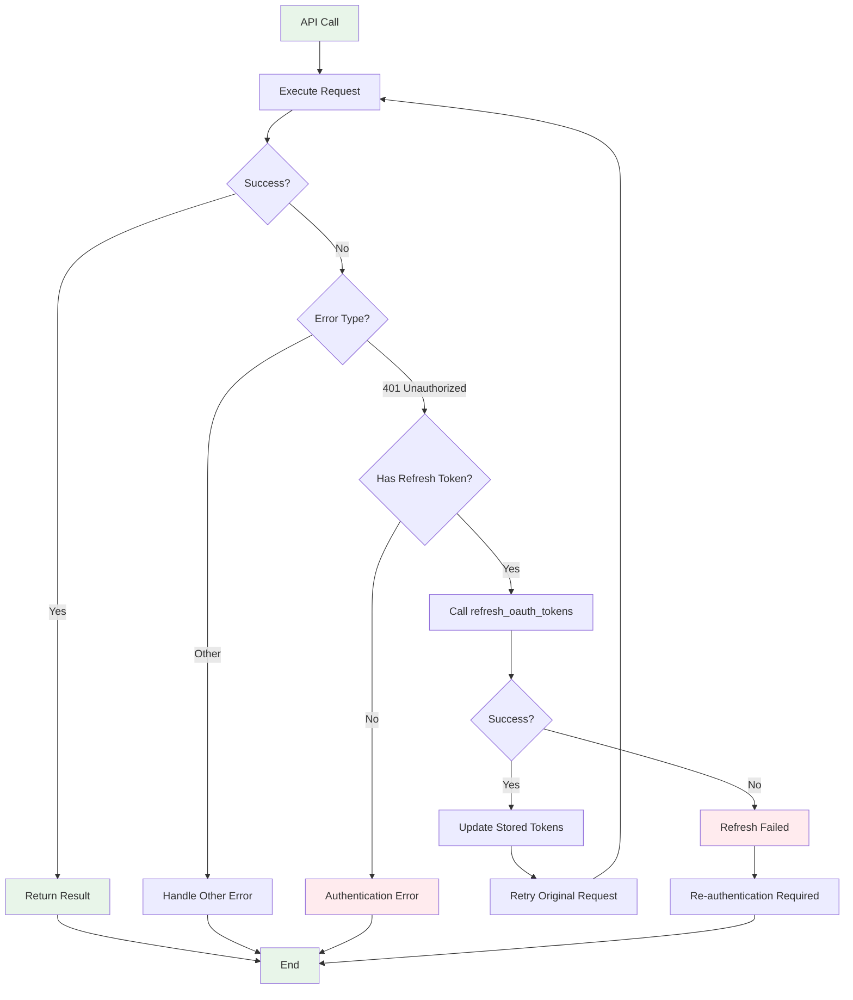
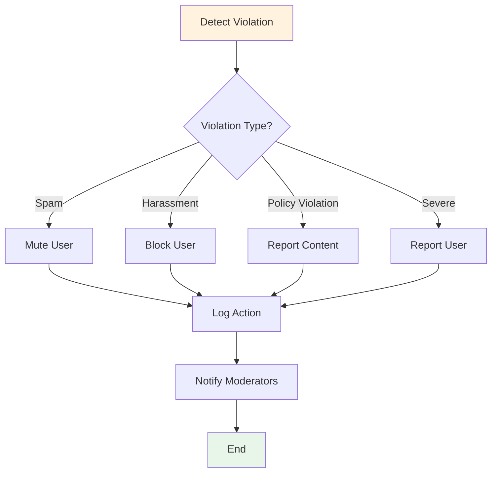
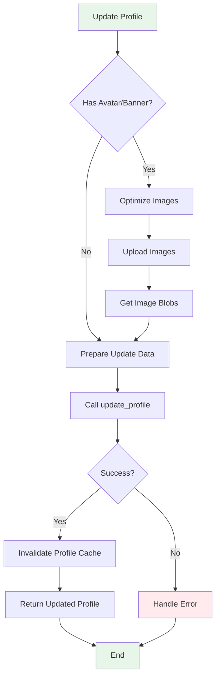
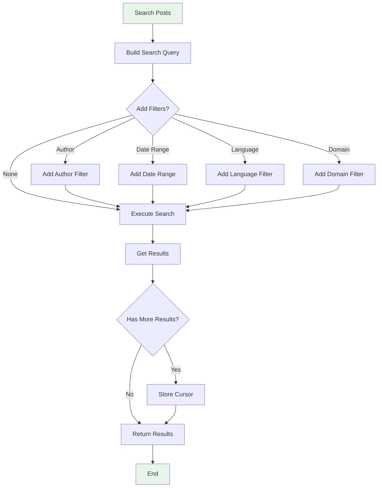
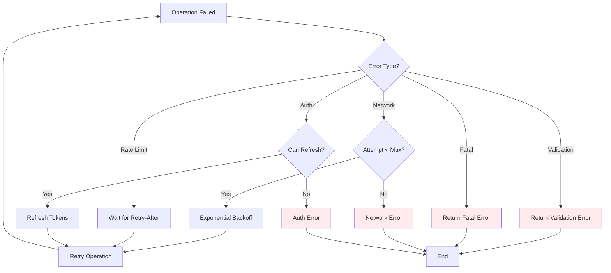
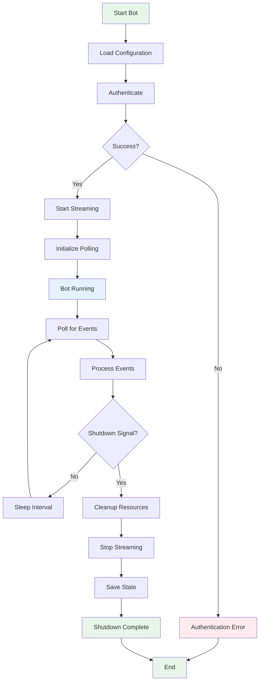

# Flow Charts

Process flow diagrams for common operations.

## OAuth Authentication Flow

## Post Creation Flow

## Streaming Setup Flow

## Token Refresh Flow

## Content Moderation Flow

## Profile Update Flow

## Search and Filter Flow

## Error Recovery Flow

## Bot Lifecycle Flow

## See Also

- [Architecture Diagrams](./architecture.md)
- [Sequence Diagrams](./sequences.md)
- [API Reference](../api/)

