# Sequence Diagrams

Interaction sequences for common operations.

## OAuth Authentication Sequence

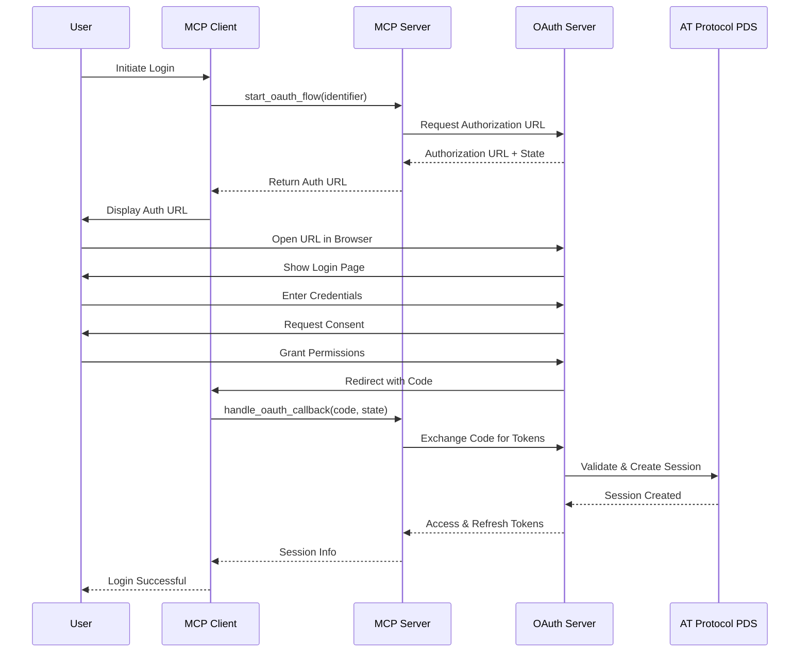

## Post Creation Sequence

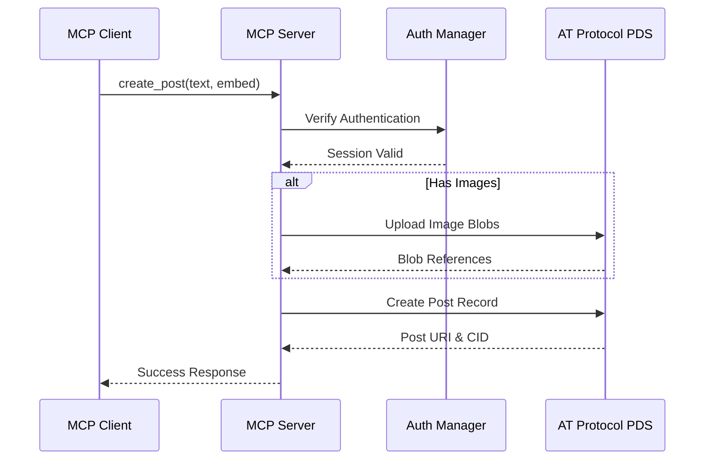

## Real-time Streaming Sequence

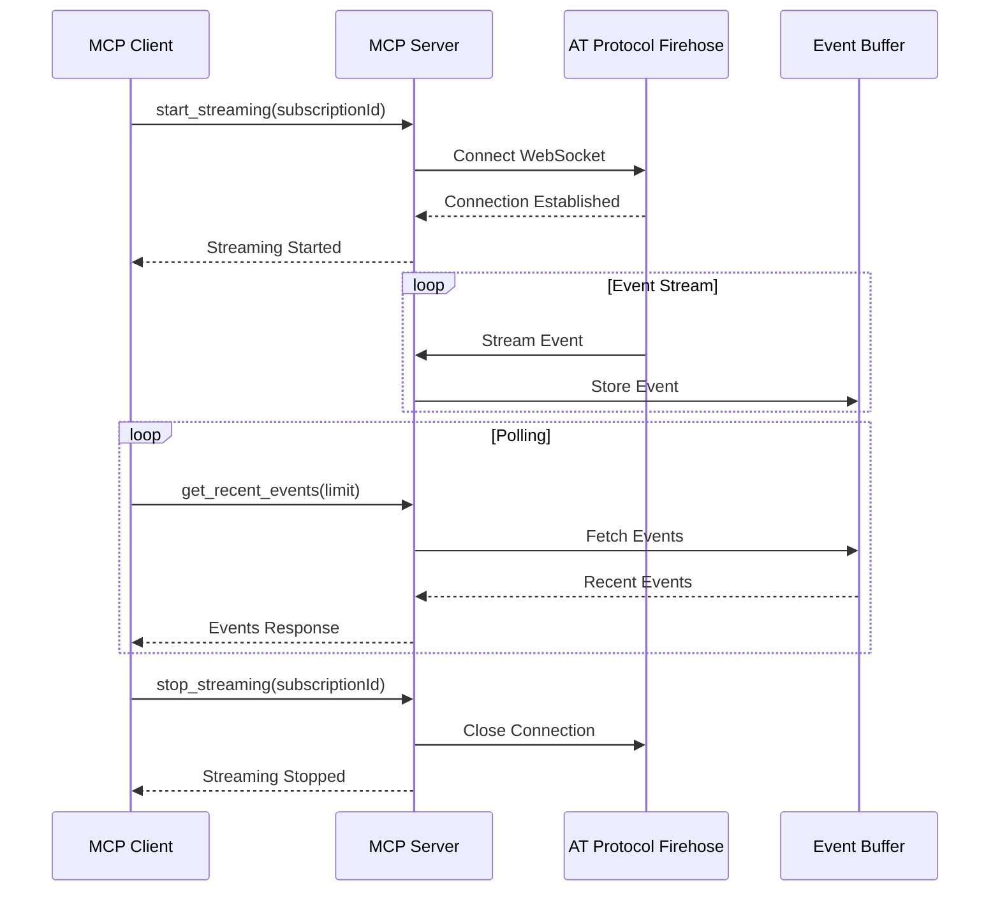

## Token Refresh Sequence

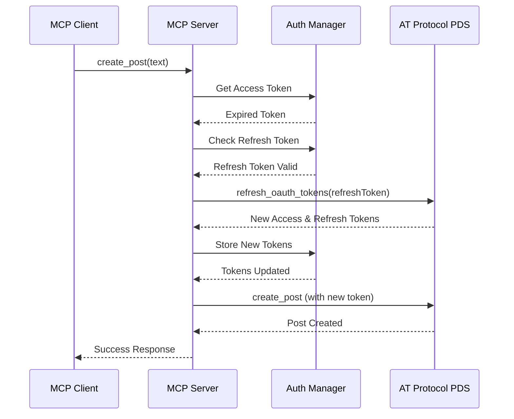

## Resource Access Sequence

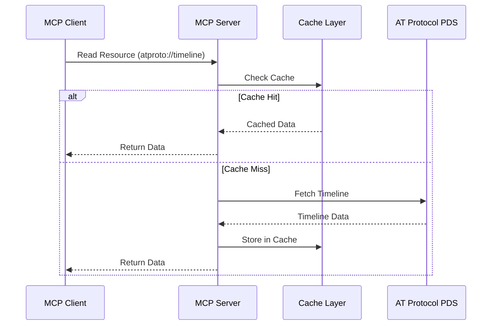

## Error Handling Sequence

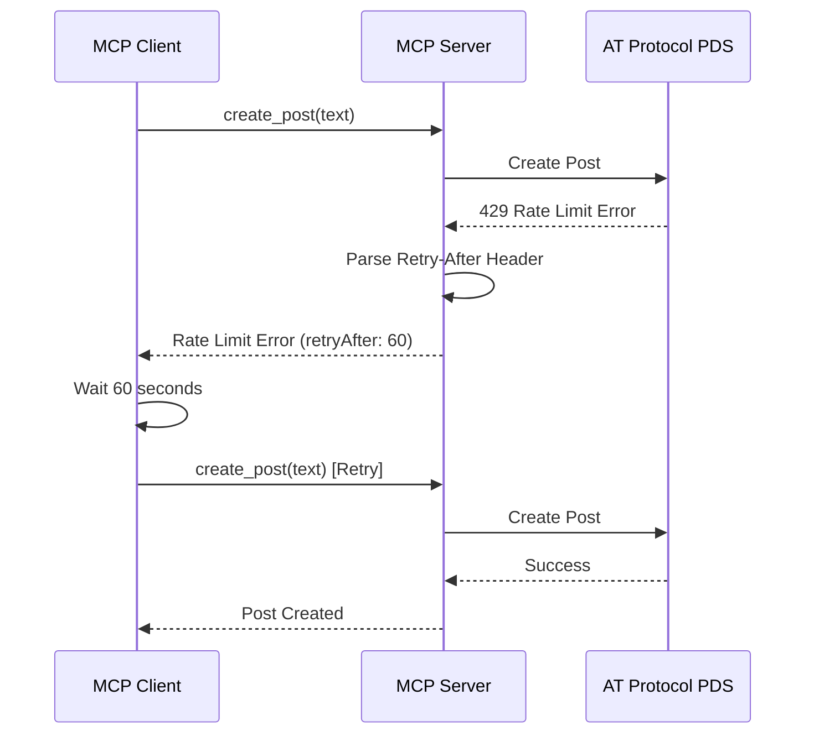

## Multi-Step Operation Sequence

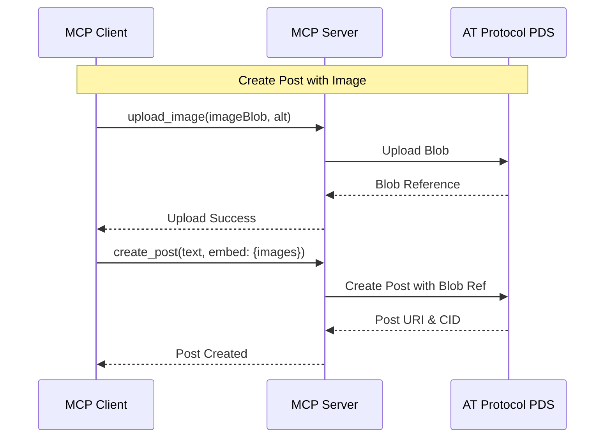

## Follow/Unfollow Sequence

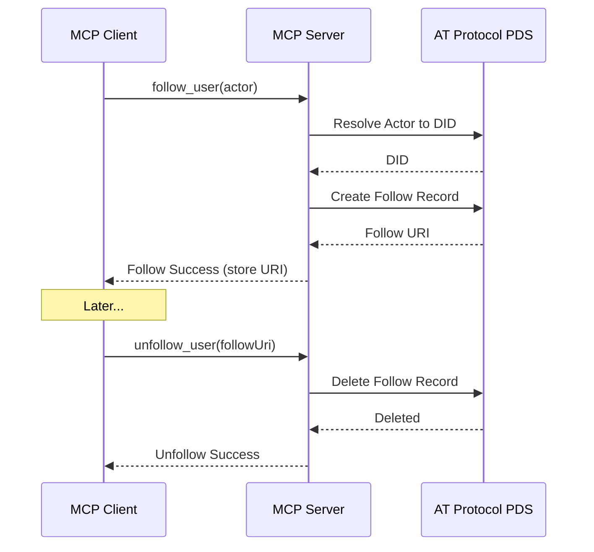

## Search and Pagination Sequence

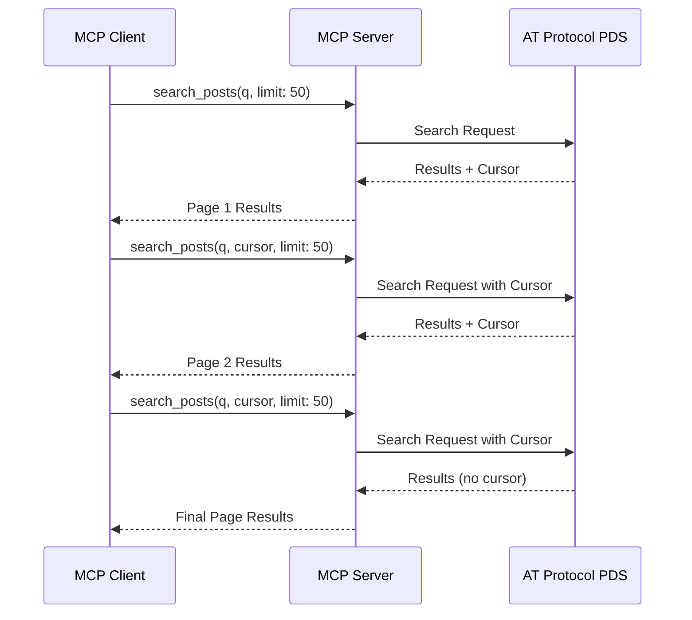

## Bot Mention Response Sequence

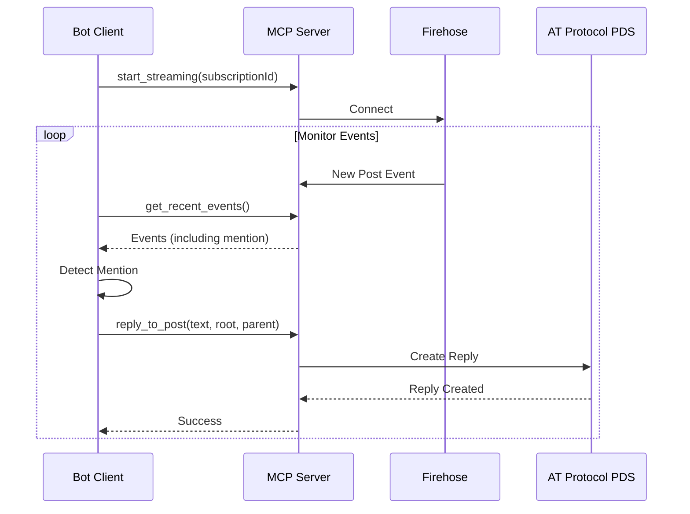

## Profile Update Sequence

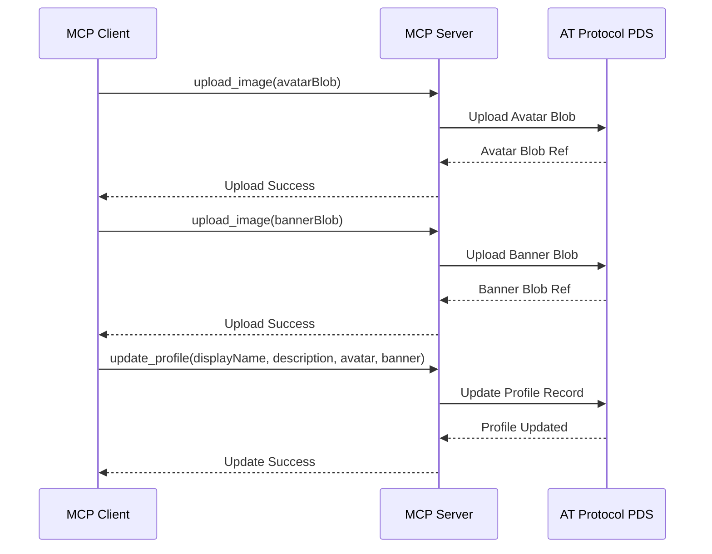

## Moderation Action Sequence

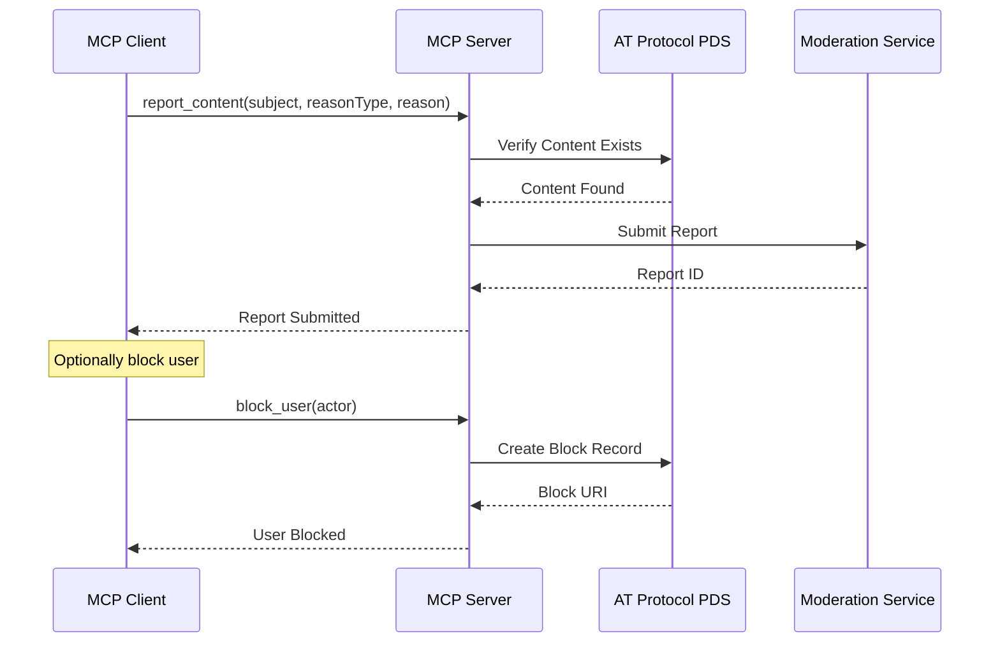

## See Also

- [Architecture Diagrams](./architecture.md)
- [Flow Charts](./flows.md)
- [API Reference](../api/)

