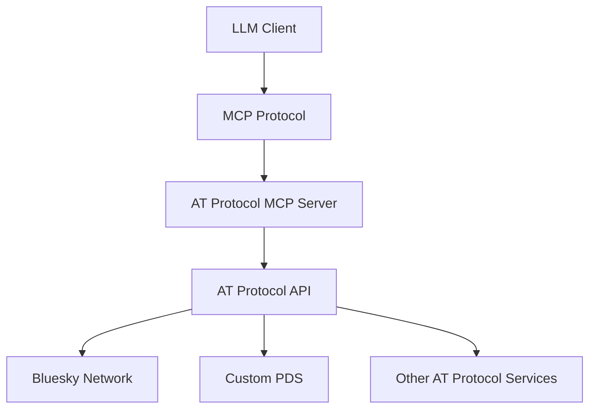

## Quick Start

Get up and running with the AT Protocol MCP Server in minutes:

```bash
# Install globally
npm install -g atproto-mcp

# Start the server
atproto-mcp --port 3000

# Or use with npx
npx atproto-mcp
```

## Key Features

### 🌐 Social Operations
- Create posts with rich text, images, and embeds
- Reply to posts with proper threading
- Like, repost, and manage reactions
- Follow and unfollow users
- Access timelines and feeds

### 📊 Data Retrieval
- Search posts and content across the network
- Retrieve user profiles and information
- Access follower and following lists
- Get real-time notifications
- Stream live data updates

### 🔐 Authentication
- Secure OAuth flow implementation
- App password support for development
- Session management and token refresh
- Multi-account support

### 🛠️ Developer Experience
- TypeScript with full type safety
- Comprehensive error handling
- Detailed logging and monitoring
- Hot reloading for development
- Extensive test coverage

## Architecture

The AT Protocol MCP Server bridges the gap between LLMs and the AT Protocol ecosystem:



## Use Cases

- **Social Media Automation**: Automate posting, engagement, and content management
- **Content Analysis**: Analyze social media trends and user behavior
- **Community Management**: Manage communities and moderate content
- **Data Integration**: Integrate AT Protocol data with other systems
- **Research & Analytics**: Conduct social media research and analytics
- **Bot Development**: Create intelligent social media bots

## Community

Join our growing community of developers building with the AT Protocol:

- 📖 [Documentation](https://cameronrye.github.io/atproto-mcp)
- 🐛 [Issue Tracker](https://github.com/cameronrye/atproto-mcp/issues)
- 💬 [Discussions](https://github.com/cameronrye/atproto-mcp/discussions)
- 🤝 [Contributing Guide](https://github.com/cameronrye/atproto-mcp/blob/main/CONTRIBUTING.md)

## License

Released under the MIT License.
