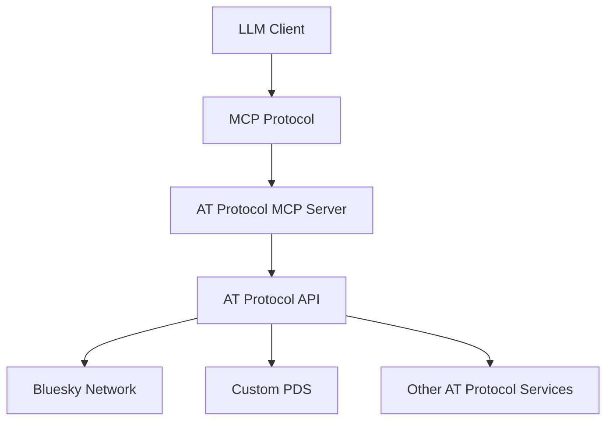

## What's New in v0.2.1

The latest release expands the toolset to 60 tools and refines the AT Protocol
integration:

::: tip Batch Operations

Perform multiple operations in a single call! Follow, like, or repost up to 25
items at once to reduce API round-trips and improve efficiency.

:::

::: tip Analytics & Insights

Summarize engagement velocity and map your network using transparent heuristics
over your own posts and graph data. These are descriptive metrics, not
machine-learning predictions.

:::

::: tip Content Discovery

Find similar users from shared follows and followers, and sample trending topics
from your home timeline.

:::

::: warning Experimental

Real-time firehose streaming and full OAuth (callback exchange, token
refresh/revoke) are registered but not yet functional. See
[Experimental & Roadmap](./guide/experimental) for current status.

:::

## Quick Start

Get up and running with the AT Protocol MCP Server in minutes:

```bash
# Install globally
npm install -g atproto-mcp

# Start the server
atproto-mcp

# Or use with npx
npx atproto-mcp
```

## Key Features

### Social Operations

- Create posts with rich text, images, and embeds
- Reply to posts with proper threading
- Like, repost, and manage reactions
- Follow and unfollow users
- Access timelines and feeds

### Data Retrieval

- Search posts and content across the network
- Retrieve user profiles and information
- Access follower and following lists
- Get notifications
- Read threads, custom feeds, and timelines

### Authentication

- App password authentication for write operations
- Unauthenticated mode for public read-only tools
- In-memory session handling

> Real-time firehose streaming and full OAuth (callback exchange, token
> refresh/revoke) are experimental and not yet functional. See
> [Experimental & Roadmap](./guide/experimental).

### Developer Experience

- TypeScript with full type safety
- Comprehensive error handling
- Detailed logging via the `--log-level` flag
- Extensive test coverage

## Architecture

The AT Protocol MCP Server bridges the gap between LLMs and the AT Protocol
ecosystem:


```mermaid
graph TB
    A[LLM Client] --> B[MCP Protocol]
    B --> C[AT Protocol MCP Server]
    C --> D[AT Protocol API]
    D --> E[Bluesky Network]
    D --> F[Custom PDS]
    D --> G[Other AT Protocol Services]
```

## Use Cases

This MCP server enables LLMs to provide powerful AT Protocol capabilities
through natural language interaction:

- **LLM-Powered Social Automation**: Enable AI assistants to manage posting,
  engagement, and content on behalf of users through conversational commands
- **AI-Driven Content Analysis**: Allow LLMs to analyze social media trends and
  user behavior through natural language queries and provide insights
- **Intelligent Community Management**: Empower LLMs to help users manage
  communities, moderate content, and engage with followers
- **Conversational Data Integration**: Let LLMs integrate AT Protocol data with
  other systems through natural language workflows
- **AI-Assisted Research & Analytics**: Enable LLMs to conduct social media
  research and analytics by querying and processing AT Protocol data
- **Smart Bot Development**: Build intelligent social media bots where LLMs
  handle natural language understanding and this server handles AT Protocol
  actions

**How it works**: Users interact with their LLM client (like Claude Desktop) in
natural language, and the LLM uses this MCP server to access AT Protocol
functionality. For example, a user might say "Search for trending posts about AI
and summarize them," and the LLM would use the `search_posts` tool to fulfill
that request.

## Community

Join our growing community of developers building with the AT Protocol:

- [Documentation](https://cameronrye.github.io/atproto-mcp)
- [Issue Tracker](https://github.com/cameronrye/atproto-mcp/issues)
- [Discussions](https://github.com/cameronrye/atproto-mcp/discussions)
- [Contributing Guide](https://github.com/cameronrye/atproto-mcp/blob/main/CONTRIBUTING.md)

## License

Released under the MIT License.

---

Made with ❤️ by [Cameron Rye](https://rye.dev/)
